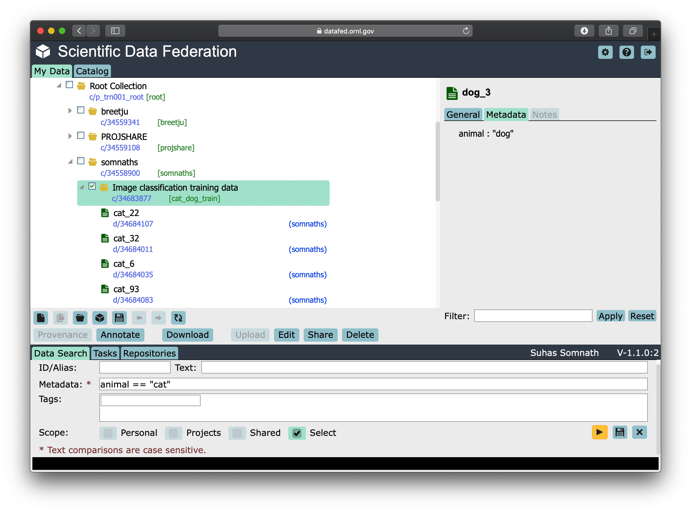
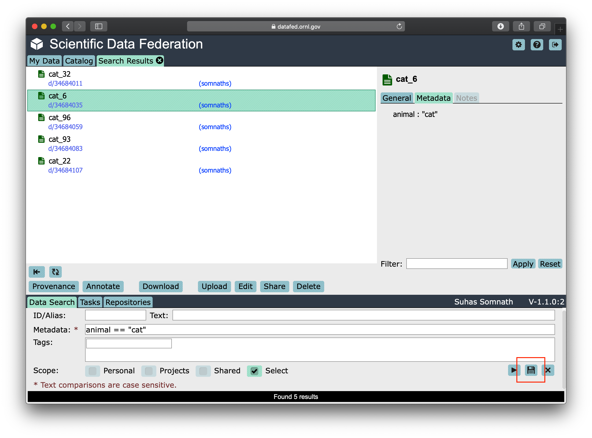

=============================
Guide to High Level Interface
=============================

There are two library modules, ``CommandLib`` and ``MessageLib``, that provide high- and-low-level application
programming interfaces (APIs), respectively, that can be used for Python scripting or custom application development.

The high-level API is provided through an API class with methods that are very similar to the commands available in the
DataFed command-line interface (CLI). Unlike the CLI, the API methods are functions that accept Python parameters and
return reply messages (as Python objects) instead of text or JSON.

The low-level API, as the module name implies, exposes the binary message-passing interface used by DataFed and is intended for more complex applications.
A user guide to the low-level API currently does not exist but will be provided in the future.

.. note::

    While not not recommended for general use, there is a ``CLI`` library module in the DataFed client package that implements
    the DataFed CLI but also provides an accessible "command" function that allows text-based CLI commands to be executed directly
    from a Python script (without requiring a system call).

This is a brief user guide that illustrates the usage of the high-level ``CommandLib`` Python API.
It is **not** meant to be an exhaustive tutorial on using ``CommandLib``.
Instead, we cover functions in ``CommandLib`` that would be used in most data orchestration scripts and custom software based on DataFed.

Users are encouraged to refer to the extensive `documentation of DataFed's CommandLib.CLI class <https://ornl.github.io/DataFed/autoapi/datafed/CommandLib/index.html>`_
for comprehensive information on all functions in the ``CommandLib.CLI`` class.

Getting Started
---------------
Users are recommended to follow the:

* `getting-started guide <../../system/getting_started.html>`_ to get accounts, and allocations on DataFed
* `installation instructions <../client/install.html>`_ to install and configure the DataFed Python package on the machine(s) where they intend to use DataFed

.. note::

   Ensure that the Globus endpoint associated with the machine where you use DataFed is active.

.. caution::

    Ensure that all DataFed Get and Put operations are within a directory that Globus has write access to.
    Otherwise, you will notice a ``Permission Denied`` error in your data transfer task messages.

Import package
~~~~~~~~~~~~~~
We start by importing just the ``API`` class within ``datafed.CommandLib`` as shown below.
We also import json to simplify the process of communicating metadata with DataFed.

.. code-block:: python

    import json # For dealing with metadata
    import os # For file level operations
    import time # For timing demonstrations
    import datetime # To demonstrate conversion between date and time formats
    from datafed.CommandLib import API

Create instance
~~~~~~~~~~~~~~~
Finally, we create an instance of the DataFed API class via:

.. code-block:: python

    df_api = API()

Assuming that DataFed has been installed and our default GlobusID configured correctly, we can now use ``df_api`` to communicate with DataFed as an authenticated user. If not, refer back to the `installation instructions <../client/install.html>`_.

DataFed Responses & Projects
----------------------------

DataFed functions and responses
~~~~~~~~~~~~~~~~~~~~~~~~~~~~~~~
Typically, users would be working in the context of a DataFed ``Project``
, which would have been created by the project's principle investigator(s) or other administrators,
rather than the user's own personal ``root`` collection.

First, let's try to find projects we are part of using the ``projectList()`` function in DataFed:

.. code-block:: python

    plist_resp = df_api.projectList()
    print(plist_resp)

.. code-block:: none

    (item {
       id: "p/abc123"
       title: "ABC123: Important Project"
       owner: "u/breetju"
     }
     item {
       id: "p/sns.dvs.1"
       title: "SNS BL-11A"
       owner: "u/stansberrydv"
     }
     item {
      id: "p/trn001"
      title: "TRN001 : DataFed Training"
      owner: "u/somnaths"
    }
    offset: 0
    count: 20
    total: 3
    , 'ListingReply')

DataFed typically responds to functions with messages.

It is important to get comfortable with these messages and extracting information from them
if one is interested in using this interface to automate data orchestration.

Let's dig into this object layer-by-layer:

The first layer is typically a tuple of size 2:

.. code-block:: python

    type(pl_resp), len(pl_resp)

.. code-block:: none

    (tuple, 2)

This tuple usually contains two key objects:

1. a message containing the information requested from DataFed
2. the *type* of that  message, which allows us to interpret the reply and parse its fields correctly -- in this case, our message is in the form of a ``'ListingReply'``.

A simple check of the object type will confirm the type of our core `Google Protocol Buffer <https://developers.google.com/protocol-buffers>`_ message:

.. code-block:: python

    type(pl_resp[0])

.. code-block:: none

    google.protobuf.internal.python_message.ListingReply

``ListingReply`` is one of a handful of different message types that DataFed replies with across all its many functions.
We will be encountering most of the different types of messages in this user guide.

Interested users are encouraged to read official documentation and `examples about Google Protobuf <https://developers.google.com/protocol-buffers/docs/pythontutorial#where-to-find-the-example-code>`_.

Protobuf messages are powerful objects that not only allow quick access to the information stored in their defined fields, but are also nominally subscriptable and iterable in Python.

Subcripting message objects
~~~~~~~~~~~~~~~~~~~~~~~~~~~
Besides the main information about the different projects, this ``ListingReply`` also provides some contextual information
such as the:

* ``count`` - Maximum number of items that could be listed in this message,
* ``total`` - Number of items listed in this message
* ``offset`` - The number of items in past listings - this denotes the concept of page numbers

Though we won't be needing the information in this case, here is how we might get the ``offset``:

.. code-block:: python

    pl_resp[0].offset

.. code-block:: none

    0

Accessing the ``item`` component produces the actual listing of projects in the message:

.. code-block:: python

    len(pl_resp[0].item)

.. code-block::

    3

Now, if we wanted to get the ``title`` field of the third project in the listing, we would access it as:

.. code-block:: python

    pl_resp[0].item[2].title

.. code-block:: none

    "TRN001 : DataFed Training"

.. note::

    We will be accessing many fields in messages going forward.
    Users are recommended to revisit this section to remind themselves how to peel each layer of the message to get to the desired field
    since we will jump straight into using a single line of code to access the desired information henceforth in the interest of brevity.

Iterating through message items
~~~~~~~~~~~~~~~~~~~~~~~~~~~~~~~
Let's say we wanted to print out ID and owner of each of the projects in the listing, we could iterate through the items as:

.. code-block:: python

    for proj in pl_resp[0].item:
        print(proj.id, '\t', proj.owner)

.. code-block:: none

    p/abc123        u/breetju
    p/sns.dvs.1     u/stansberrydv
    p/trn001 	    u/somnaths

Exploring projects
~~~~~~~~~~~~~~~~~~
We can take a look at basic information about a project using the ``projectView()`` function:

.. code-block:: python

    df_api.projectView('p/trn001')

.. code-block:: none

    (proj {
      id: "p/trn001"
      title: "TRN001 : DataFed Training"
      desc: "DataFed Training project"
      owner: "u/somnaths"
      ct: 1610905375
      ut: 1610912585
      admin: "u/stansberrydv"
      admin: "u/breetju"
      alloc {
        repo: "cades-cnms"
        data_limit: 1073741824
        data_size: 0
        rec_limit: 1000
        rec_count: 0
        path: "/data10t/cades-cnms/project/trn001/"
      }
    }
    , 'ProjectDataReply')

Note that we got a different kind of reply from DataFed - a ``ProjectDataReply`` object.
The methodology to access information in these objects is identical to that described above.
Nonetheless, this response provides some useful information such as the administrators, creation date, etc.
that might be useful for those members or administrators of several projects.

Contexts, aliases & IDs
-----------------------
Just as people have various facets within their own life such as their personal and professional lives,
DataFed too offers similar capabilities via contexts.
Users in DataFed have their own ``Personal Data`` context as well as other contexts in the form of
``Projects`` as we have seen above.

Default context
~~~~~~~~~~~~~~~

We can always ask DataFed what ``context`` it is using via the ``getContext()`` function:

.. code-block:: python

    print(df_api.getContext())

.. code-block:: none

    'u/somnaths'

As mentioned earlier, DataFed typically replies with a Google Protobuf message object.
However, ``getContext()`` is among the few functions where DataFed returns a simple string.

The return value from ``getContext()`` reveals that DataFed is assuming that we intend to work
within the User's ``Personal Data``.

.. note::

    DataFed starts with its context set by default to the User's ``Personal Data``
    rather than any project

.. caution::

    Though the CommandLib interface of DataFed sets the default context to the User's
    ``Personal Data``, it is not necessary that the user have a valid data allocation
    to create and store data in their ``Personal Data``.

There are ways to set the context, one can set the context only within the scope of a function or simply reset the default scope.

Context per function
~~~~~~~~~~~~~~~~~~~~
Every space in DataFed, regardless of whether it is a ``Project`` or the user's own ``Personal Data``
contains a Collection called ``root``, which contains all other Data Records and Collections within this space.

Let us take a look at the ``root`` Collection in the Training project.

In order to look at the Collection, we will be using the ``collectionView()`` function.
We will be going over this specific function later in greater detail,
but will use it here to illustrate another concept.

Since we are interested in the ``root`` Collection within the ``context`` of the Training ``Project``,
and not the ``User`` ``Personal Data`` which is the current (default) ``context``,
we can specify the context for this function call using the ``context`` keyword argument as:

.. code-block:: python

    print(df_api.collectionView('root', context='p/trn001'))

.. code-block:: none

    (coll {
       id: "c/p_trn001_root"
       title: "Root Collection"
       alias: "root"
       desc: "Root collection for project trn001"
       owner: "p/trn001"
       notes: 0
     }, 'CollDataReply')

This function returns a different, yet somewhat similar response to that from the ``projectView()`` function - a ``CollDataReply`` object.

The ``desc`` field in the above response illustrates that,
we did in fact get information regarding the ``root`` Collection belonging to the Training project and not the user's ``Personal Data`` space.

Let's see what would have happened if we did not specify the ``context`` via the keyword argument:

.. code-block:: python

    print(df_api.collectionView('root'))

.. code-block:: none

    (coll {
       id: "c/u_somnaths_root"
       title: "root"
       desc: "Root collection for user Suhas Somnath (somnaths)"
       owner: "u/somnaths"
       notes: 0
     }, 'CollDataReply')

From the ``desc`` field in the above output, we observe that simply asking for ``root`` Collection returns information about the
user's ``Personal data`` rather than the ``root`` Collection in Training project.

Contents of contexts
~~~~~~~~~~~~~~~~~~~~
Now that we know how to get to the correct ``root`` Collection,
we can take a look at the contents of the project by listing everything in the project's
``root`` collection using the ``collectionItemsList()`` function as shown below:

.. code-block:: python

    ls_resp = df_api.collectionItemsList('root', context='p/trn001')
    print(ls_resp)

.. code-block:: none

    (item {
       id: "c/34559341"
       title: "breetju"
       alias: "breetju"
       owner: "p/trn001"
       notes: 0
     }
     item {
       id: "c/34559108"
       title: "PROJSHARE"
       alias: "projshare"
       owner: "p/trn001"
       notes: 0
     }
     item {
       id: "c/34558900"
       title: "somnaths"
       alias: "somnaths"
       owner: "p/trn001"
       notes: 0
     }
     item {
       id: "c/34559268"
       title: "stansberrydv"
       alias: "stansberrydv"
       owner: "p/trn001"
       notes: 0
     }
     offset: 0
     count: 20
     total: 4, 'ListingReply')

Just as in the ``projectList()`` function, this function too returns a ``ListingReply`` message.
Here, we see that the administrator of the project has created some collections for the private
use of project members and a collaborative space called ``PROJSHARE``

.. note::

    Not all projects would be structured in this manner.

Alias vs ID
~~~~~~~~~~~
So far, we have been addressing the Collections via their ``alias`` - a human readable unique identifier.
Though aliases are indeed a convenient way to address items in DataFed, there are a few things to keep in mind:

.. note::

    The ``alias`` for a Data Record or Collection is unique only within a user's ``Personal Data`` or ``Project`` context.
    One would need to supply the ``context`` when addressing a Record or Collection via its ``alias``

Not supplying the ``context`` when addressing via an ``alias`` would result in an error:

.. code-block:: python

    df_api.collectionView('somnaths')

.. code-block:: pytb

    ---------------------------------------------------------------------------
    Exception                                 Traceback (most recent call last)
    <ipython-input-20-acb948617f34> in <module>
    ----> 1 df_api.collectionItemsList('somnaths')

    //anaconda/lib/python3.5/site-packages/datafed/CommandLib.py in collectionItemsList(self, coll_id, offset, count, context)
        757         msg.id = self._resolve_id( coll_id, context )
        758
    --> 759         return self._mapi.sendRecv( msg )
        760
        761

    //anaconda/lib/python3.5/site-packages/datafed/MessageLib.py in sendRecv(self, msg, timeout, nack_except)
        299         self.send( msg )
        300         _timeout = (timeout if timeout != None else self._timeout)
    --> 301         reply, mt, ctxt = self.recv( _timeout, nack_except )
        302         if reply == None:
        303             return None, None

    //anaconda/lib/python3.5/site-packages/datafed/MessageLib.py in recv(self, timeout, nack_except)
        343         if msg_type == "NackReply" and _nack_except:
        344             if reply.err_msg:
    --> 345                 raise Exception(reply.err_msg)
        346             else:
        347                 raise Exception("Server error {}".format( reply.err_code ))

    Exception: Alias 'somnaths' does not exist
    (source: dbGet:126 code:1)

.. note::

    All Data Records and Collections always have a unique alphanumeric identifier or ``ID`` even if the
    user did not specify a human-friendly ``alias``

An alternate way to address a Data Record or Collection is via its ``ID``:

.. code-block:: python

    df_api.collectionView('c/34558900')

.. code-block:: none

    (coll {
       id: "c/34558900"
       title: "somnaths"
       alias: "somnaths"
       owner: "p/trn001"
       ct: 1610905632
       ut: 1610905667
       notes: 0
     }, 'CollDataReply')

We observe that we can successfully get information about an entity in DataFed using its ID.

.. note::

    ``ID`` for Records, Collections, etc. in projects are unique across all of DataFed, and are not just
    unique within a narrow scope such as within that of a Project or User's space.
    It is therefore unnecessary to provide the ``context`` when addressing an item via its unique ID.

However, one would need to carefully extract the (automatically generated) ID of the Collection or Data Record of interest
from the DataFed response in order to use it in subsequent code within a script.

.. caution::

    When working within the ``context`` of a Project with several collaborators,
    there is a possibility that two users may use the same ``alias`` for a Record or a Collection.

**Managing aliases within Projects:**

There is no single solution to this problem. However, here are some suggestions:

* Team members of the project should coordinate and collaboratively assign aliases
* Individual members elect to avoid using aliases within the context of their personal Collections
* Individual members manually prefix aliases for items within their personal Collections with their initials (hopefully unique within the Project)

Manual context management
~~~~~~~~~~~~~~~~~~~~~~~~~
In this user guide, we will work within the context of the training project.
In order to ensure that we continue to work within this context -
create data records, collections, etc. within this space,
we need to ensure that we minimize ambiguity about the context.

A naive approach is to simply define a python variable and use it in every function call
instead of manually specifying it as we have done above:

.. code-block:: python

    context = 'p/trn001' # DataFed ID for the training project

.. note::

    Please change the ``context`` variable to suit your own project.
    If you want to work within your own ``Personal Data`` space,
    set ``context`` to ``None``.

.. caution::

    Accidentally forgetting to specify the ``context`` keyword argument in functions could
    result in incorrect data management operations.

Set default context
~~~~~~~~~~~~~~~~~~~
Keeping track of and remembering to specify the ``context`` keyword argument for all
function calls can be tedious if one is surely going to be working within a single context.

In such cases, DataFed provides the ``setContext()`` function that allows the user to
specify the default context going forward:

.. code-block:: python

    df_api.setContext('p/trn001')

.. note::

    ``setContext()`` is valid within the scope of a single python process.
    The user would need to call the function each time they instantiate the DataFed ``CommandLib.API`` class

Now, one could operate on items within the project without having to specify the ``context``
keyword argument. For example, running the same ``collectionView()`` function that failed earlier
would work now:

.. code-block:: python

    df_api.collectionView('somnaths')

.. code-block:: none

    (coll {
       id: "c/34558900"
       title: "somnaths"
       alias: "somnaths"
       owner: "p/trn001"
       ct: 1610905632
       ut: 1610905667
       notes: 0
     }, 'CollDataReply')

If we wanted to temporarily operate on a different context such as the user's ``Personal Data``,
we would need to specify the ``context`` keyword argument explicitly for those function calls.

Set working collection
~~~~~~~~~~~~~~~~~~~~~~
In this specific case, the Project has been organized to provide each user with their own
private collection.

We can use a python variable to help ensure that any Data Records or Collections we want to create in our
private space is created within our own collection (``somnaths`` in this case) rather than
creating clutter in the ``root`` collection of the project:

.. code-block:: python

    username = 'somnaths' # Name of this user

.. note::

    Please change the ``username`` variable to suit your own project.
    If you want to work within your own ``root`` collection,
    set ``username`` to ``root``.

Data Records
------------

Prepare (scientific) metadata
~~~~~~~~~~~~~~~~~~~~~~~~~~~~~
DataFed can accept metadata as dictionaries in python or as a JSON file.

Here, we simply create a dictionary with fake metadata in place of the real metadata:

.. code-block:: python

    parameters = {
                  'a': 4,
                  'b': [1, 2, -4, 7.123],
                  'c': 'Something important',
                  'd': {'x': 14, 'y': -19} # Can use nested dictionaries
                  }

Create Data Record
~~~~~~~~~~~~~~~~~~
Until a future version of DataFed, which can accept a python dictionary itself instead
of a JSON file or a JSON string for the metadata, we will need to use ``json.dumps()``
function to turn our python metadata dictionary ``parameters`` into a JSON string, or
write the dictionary to a JSON file:

.. code-block:: python

    dc_resp = df_api.dataCreate('my important data',
                                metadata=json.dumps(parameters),
                                parent_id=username, # parent collection
                                )

Here, the ``parent_id`` was set to the ``username`` variable, as this is the alias of our
personal collection within the project, in which our data record will be created.
Leaving this unspecified is equivalent to the default value of ``root`` which means that
the Data Record would be created within the ``root`` collection of the project.

Extract Record ID
~~~~~~~~~~~~~~~~~

Let's look at the response we got for the ``dataCreate()`` function call:

.. code-block:: python

    print(dc_resp)

.. code-block:: none

    (data {
       id: "d/34682319"
       title: "my important data"
       metadata: "{\"a\":4,\"b\":[1,2,-4,7.123],\"c\":\"Something important\",\"d\":{\"x\":14,\"y\":-19}}"
       repo_id: "repo/cades-cnms"
       size: 0.0
       ext_auto: true
       ct: 1611077217
       ut: 1611077217
       owner: "p/trn001"
       creator: "u/somnaths"
       parent_id: "c/34558900"
     }, 'RecordDataReply')

DataFed returned a ``RecordDataReply`` object, which contains crucial pieces of information regarding the record.

.. note::

    In the future, the ``dataCreate()`` function would by default return only the ``ID`` of the record
    instead of such a verbose response if it successfully created the Data Record.
    We expect to be able to continue to get this verbose response through an optional argument.

    Such detailed information regarding the record can always be obtained via the ``dataView()`` function.

Similar to getting the title from the project information, if we wanted to get the
record ID to be used for later operations, here's how we could go about it:

.. code-block:: python

    record_id = dc_resp[0].data[0].id
    print(record_id)

.. code-block:: none

    'd/34682319'

Edit Record information
~~~~~~~~~~~~~~~~~~~~~~~
All information about Data Records, besides the unique ``ID``, can be edited using the
``dataUpdate()`` command. For example, if we wanted to change the title, add a human-readable
unique ``alias``, and **add** to the scientific metadata, we would as follows:

.. code-block:: python

    du_resp = df_api.dataUpdate(record_id,
                                title='Some new title for the data',
                                alias='my_first_dataset',
                                metadata=json.dumps({'appended_metadata': True})
                                )
    print(du_resp)

.. code-block:: none

    (data {
      id: "d/34682319"
      title: "Some new title for the data"
      alias: "my_first_dataset"
      repo_id: "repo/cades-cnms"
      size: 0.0
      ext_auto: true
      ct: 1611077217
      ut: 1611077220
      owner: "p/trn001"
      creator: "u/somnaths"
      notes: 0
    }
    update {
      id: "d/34682319"
      title: "Some new title for the data"
      alias: "my_first_dataset"
      owner: "p/trn001"
      creator: "u/somnaths"
      size: 0.0
      notes: 0
      deps_avail: true
    }
    , 'RecordDataReply')

.. note::

    In the future, the ``dataUpdate()`` command would return only an acknowledgement
    of the successful execution of the data update.

View Record information
~~~~~~~~~~~~~~~~~~~~~~~
Since the response from the ``dataCreate()`` and ``dataUpdate()`` functions does not include the
metadata, we can always get the most comprehensive information about Data Records via the ``dataView()`` function:

.. code-block:: python

    dv_resp = df_api.dataView(record_id)
    print(dv_resp)

.. code-block:: none

    (data {
       id: "d/34682319"
       title: "Some new title for the data"
       alias: "my_first_dataset"
       metadata: "{\"a\":4,\"appended_metadata\":true,\"b\":[1,2,-4,7.123],\"c\":\"Something important\",\"d\":{\"x\":14,\"y\":-19}}"
       repo_id: "repo/cades-cnms"
       size: 0.0
       ext_auto: true
       ct: 1611077217
       ut: 1611077220
       owner: "p/trn001"
       creator: "u/somnaths"
       notes: 0
     }, 'RecordDataReply')

The date and time in the Data Records are encoded according to the Unix time format and
can be converted to familiar python ``datetime`` objects via ``fromtimestamp()``:

.. code-block:: python

    datetime.datetime.fromtimestamp(dv_resp[0].data[0].ct)

.. code-block:: none

    datetime.datetime(2021, 1, 19, 12, 26, 57)

Extract metadata
~~~~~~~~~~~~~~~~
As the response above shows, the metadata is also part of the response we got from ``dataView()``.

By default, the metadata in the response is formatted as a JSON string:

.. code-block:: python

    print(dv_resp[0].data[0].metadata)

.. code-block:: none

    "{\"a\":4,\"appended_metadata\":true,\"b\":[1,2,-4,7.123],\"c\":\"Something important\",\"d\":{\"x\":14,\"y\":-19}}"

In order to get back a python dictionary, use ``json.loads()``

.. code-block:: python

    print(json.loads(dv_resp[0].data[0].metadata))

.. code-block:: none

    {'a': 4,
     'appended_metadata': True,
     'b': [1, 2, -4, 7.123],
     'c': 'Something important',
     'd': {'x': 14, 'y': -19}}

We can clearly observe that both the original and the new metadata are present in the record.

Replace metadata
~~~~~~~~~~~~~~~~
In the example above, we appended metadata to existing metadata, which is the default manner in which ``dataUpdate()`` operates.
If desired, we could completely replace the metadata by setting ``metadata_set`` to ``True`` as in:

.. code-block:: python

    du_resp = df_api.dataUpdate(record_id,
                                metadata=json.dumps({'p': 14, 'q': 'Hello', 'r': [1, 2, 3]}),
                                metadata_set=True,
                                )
    dv_resp = df_api.dataView(record_id)
    print(json.loads(dv_resp[0].data[0].metadata))

.. code-block:: none

    {'p': 14, 'q': 'Hello', 'r': [1, 2, 3]}

The previous metadata keys such as ``a``, ``b``, ``c``, etc. have all been replaced by the new metadata fields.

Relationships and provenance
~~~~~~~~~~~~~~~~~~~~~~~~~~~~
Let's say that this first dataset went through some processing step which resulted in one or more new datasets.
This processing step could be something as simple as a data cleaning operation or as complex as a multi-institutional
cross-facility workflow.
We could not only track the resultant new datasets as Data Records in DataFed but also the relationships between the datasets.

.. note::

    We will cover topics related to associating raw data to Data Records in the next section.

First, we create Data Records as we have done earlier for the new datasets using the ``dataCreate()`` function:

.. code-block:: python

    dc2_resp = df_api.dataCreate('cleaned data',
                                  metadata=json.dumps({'cleaning_algorithm': 'gaussian_blur', 'size': 20}),
                                  parent_id=username, # parent collection
                                 )
    clean_rec_id = dc2_resp[0].data[0].id
    print(clean_rec_id)

.. code-block:: none

    'd/34682715'

We can establish a relationship or ``dependency`` between the original / source Data Record and the subsequent Data Record
via several methods such as within the ``dataCreate()`` function call or via a subsequent ``dataUpdate()`` call.

Dependencies in DataFed are specified as a ``list`` of relationships, themselves specified as ``list`` objects,
wherein the first item in the list is the relationship type and the second item is the identifier of the related Data Record.

As of this writing, DataFed supports the following relationships:

* ``der`` - Is derived from
* ``comp`` - Is comprised of
* ``ver`` - Is new version of

For our example, we will say that our new Record is derived from our original record via the ``dataUpdate()`` function:

.. code-block:: python

    dep_resp = df_api.dataUpdate(clean_rec_id, deps_add=[["der", record_id]])
    print(dep_resp)

.. code-block:: none

    (data {
       id: "d/34682715"
       title: "cleaned data"
       repo_id: "repo/cades-cnms"
       size: 0.0
       ext_auto: true
       ct: 1611077405
       ut: 1611078386
       owner: "p/trn001"
       creator: "u/somnaths"
       deps {
         id: "d/34682319"
         alias: "my_first_dataset"
         type: DEP_IS_DERIVED_FROM
         dir: DEP_OUT
       }
       notes: 0
     }
     update {
       id: "d/34682715"
       title: "cleaned data"
       owner: "p/trn001"
       creator: "u/somnaths"
       size: 0.0
       notes: 0
       deps_avail: true
       dep {
         id: "d/34682319"
         alias: "my_first_dataset"
         type: DEP_IS_DERIVED_FROM
         dir: DEP_OUT
       }
     }, 'RecordDataReply')

The response shows that we did in fact manage to establish the ``DEP_IS_DERIVED_FROM`` relationship.

In the DataFed web interface, when one selects either the original or derived Records and
clicks on the ``Provenance`` view, we will observe that there is an
arrow originating from the original Data Record and terminating into the newly created Data Record:

.. image:: ../../_static/python_high_level/provenance.png

Batch operations
~~~~~~~~~~~~~~~~
DataFed has the ``dataBatchCreate()`` and ``dataBatchUpdate()`` functions to facilitate
the creation and editing of multiple Data Records in one shot.

Other functions
~~~~~~~~~~~~~~~
DataFed also offers the ``dataDelete()`` function for the deletion of one or more Data Records

Data Transfer
-------------
Upload raw data
~~~~~~~~~~~~~~~
So far, the Data Record created above only contains simple text information
along with the scientific metadata. It does not have the raw data that we
colloquially refer to as "data" in science.

For the sake of demonstration, we will just use the metadata as the data itself:

.. code-block:: python

    with open('parameters.json', mode='w') as file_handle:
        json.dump(parameters, file_handle)

With the data file created, we are ready to put this raw data into the record we created above.

.. note::

   The raw data file must be located such that it is visible to the (default) Globus endpoint. To configure the default endpoint,
   follow the steps detailed towards the end of the `installation instructions <../client/install.html>`_.

.. note::

   Ensure that the Globus endpoint that will be used for uploading data is active.

.. code-block:: python

    put_resp = df_api.dataPut(record_id,
                              './parameters.json',
                              wait=True, # Waits until transfer completes.
                              )
    print(put_resp)

.. code-block:: none

    (item {
       id: "d/34682319"
       title: "Some new title for the data"
       size: 0.0
       owner: "p/trn001"
     }
    task {
       id: "task/34702491"
       type: TT_DATA_PUT
       status: TS_SUCCEEDED
       client: "u/somnaths"
       step: 3
       steps: 4
       msg: "Finished"
       ct: 1611102437
       ut: 1611102444
       source: "olcf#dtn/gpfs/alpine/stf011/scratch/somnaths/DataFed_Tutorial/parameters.json"
       dest: "d/34682319"
     }, 'DataPutReply')

The ``dataPut()`` method initiates a Globus transfer on our behalf
from the machine where the command was entered to wherever the default data repository is located.

.. note::

   The above data file was specified by its relative local path, so DataFed used our pre-configured default Globus endpoint to find
   the data file. As long as we have the id for any *active* Globus endpoint that we have authenticated access to, we can transfer
   data from that endpoint with its full absolute file path -- even if the file system is not attached ot the local machine. Look for
   more information on this in later examples.

In addition, the ``dataPut()`` method prints out the status of the Globus transfer as shown under the ``task`` section of the response.
The ``task`` ``msg`` shows that the Globus transfer succeeded. The transfer succeeded before the message was returned because
the ``wait`` keyword argument in the ``dataPut()`` method was set to ``True``, meaning that we requested that DataFed not proceed
until the Globus transfer was completed.

This is not the default behavior of ``dataPut()`` or ``dataGet()``.
In a later section, we will go over an example usecase wherein asynchronous transfers may be preferred.

Let's view the Data Record we have been working on so far:

.. code-block:: python

    dv_resp = df_api.dataView(record_id)
    print(dv_resp)

.. code-block:: none

    (data {
       id: "d/34682319"
       title: "Some new title for the data"
       alias: "my_first_dataset"
       metadata: "{\"p\":14,\"q\":\"Hello\",\"r\":[1,2,3]}"
       repo_id: "repo/cades-cnms"
       size: 86.0
       source: "olcf#dtn/gpfs/alpine/stf011/scratch/somnaths/DataFed_Tutorial/parameters.json"
       ext: ".json"
       ext_auto: true
       ct: 1611077217
       ut: 1611077286
       dt: 1611077286
       owner: "p/trn001"
       creator: "u/somnaths"
       notes: 0
     }, 'RecordDataReply')

Comparing this response against the response we got from the last ``dataView()`` call,
you will notice the ``source`` and ``file extension`` have been updated.

Download raw data
~~~~~~~~~~~~~~~~~
DataFed is also capable of getting data stored in a DataFed repository and placing it in the
local or other Globus-visible filesystem via the ``dataGet()`` function.

For demonstration purposes, we will simply download the raw data (.JSON file) that was placed into the first Data Record.

In order to avoid clashes in file-naming, ``dataGet()`` names the downloaded file by the unique ID of the Data Record
that contains the raw data. We already have a ``parameters.json`` file in our local folder and setting the ``orig_fname``
keyword argument to ``True`` would result in a clash in the file name.

Just to prove that the file download is indeed taking place, let's check to make sure that there is no other JSON file
whose name matches that of the record ID.

.. code-block:: python

    expected_file_name = os.path.join('.', record_id.split('d/')[-1]) + '.json'
    print(expected_file_name)

.. code-block:: none

    ./34682319.json

.. code-block:: python

    print(os.path.exists(expected_file_name))

.. code-block:: none

    False

Now that we know that we will not be having a file name clash, let us proceed with the ``dataGet()`` function call.

.. note::

    The current version of DataFed has a bug where ``dataGet()`` **only** accepts a ``list`` of Data Record or Collection IDs.
    Until the next version, users are recommended to put their singular ID into a ``list`` for ``dataGet()``.

.. code-block:: python

    get_resp = df_api.dataGet([record_id], # currently only accepts a list of IDs / aliases
                              '.', # directory where data should be downloaded
                              orig_fname=False, # do not name file by its original name
                              wait=True, # Wait until Globus transfer completes
                             )
    print(get_resp)

.. code-block:: none

    (task {
      id: "task/34682556"
      type: TT_DATA_GET
      status: TS_SUCCEEDED
      client: "u/somnaths"
      step: 2
      steps: 3
      msg: "Finished"
      ct: 1611077310
      ut: 1611077320
      source: "d/34682319"
      dest: "olcf#dtn/gpfs/alpine/stf011/scratch/somnaths/DataFed_Tutorial"
    }
    , 'TaskDataReply')

The response shows that the Globus file transfer to the local file system did indeed complete successfully.
Now, let us verify that the file does indeed exist as it should:

.. code-block:: python

    print(os.path.exists(expected_file_name))

.. code-block:: none

    True

At this point, we are free to rename the downloaded file to whatever name we want using familiar python functions:

.. code-block:: python

    os.rename(expected_file_name, 'duplicate_parameters.json')

Tasks
~~~~~
DataFed makes it possible to check on the status of transfer tasks in an easy and programmatic manner.

From the earlier ``dataGet()`` function call's response, we can extract the ``task id`` as:

.. code-block:: python

    task_id = get_resp[0].task[0].id
    print(task_id)

.. code-block:: none

    task/34682556

Using the task ID, we can check on the status of the ``task`` via the ``taskView()`` function:

.. code-block:: python

    task_resp = df_api.taskView(task_id)
    print(task_resp)

.. code-block:: none

    (task {
      id: "task/34682556"
      type: TT_DATA_GET
      status: TS_SUCCEEDED
      client: "u/somnaths"
      step: 2
      steps: 3
      msg: "Finished"
      ct: 1611077310
      ut: 1611077320
      source: "d/34682319"
      dest: "olcf#dtn/gpfs/alpine/stf011/scratch/somnaths/DataFed_Tutorial"
    }
    , 'TaskDataReply')

The ``TaskDataReply`` shows that the ``status`` is indeed a success and the ``msg`` is ``"Finished"``.

This specific example by itself was trivial since we had set the ``wait`` keyword argument to ``True`` in the ``dataGet()`` function
call, which meant that DataFed would not proceed until the transfer was complete.
Furthermore, the nature of the transfer was also trivial in that it was a single file located in a single DataFed
repository being delivered to a single destination.

.. note::

    A DataFed ``task`` may itself contain / be responsible for several Globus file transfers.

As the structure of the ``dataGet()`` function call suggests, one could request that several Data Records or
Data Collections (themselves containing thousands of Data Records or even Collections) be downloaded,
regardless of their location (several DataFed data repositories spread across the world in multiple institutions / continents).
In this case, the ``task`` would be a composite of several Globus data transfers.

We can also extract the status of the ``task`` as:

.. code-block:: python

    task_resp[0].task[0].status

.. code-block:: none

    3

Note that though the status was marked as ``TS_SUCCEEDED`` in the Google Protobuf object,
we got an integer value for the status.
For now, we will use the numeric value of ``3`` to denote the successful completion of a file transfer task.

.. note::

    A future version of DataFed may change the nature of the output / type for the ``status``
    property. In general, the exact return object types and nomenclature may evolve with DataFed.

Asynchronous transfers
~~~~~~~~~~~~~~~~~~~~~~
So far we have been requesting that all transfers be completed before the next line of
python code is executed. This is certainly acceptable for small data files but is perhaps not
ideal for large files.

Here are some scenarios:

* We are performing an array of simulations and want data transfers for a completed
  simulation to take place in the background while the subsequent simulation is being
  computed.
* We may want to get multiple Data Records or Collections which may
  actually be spread over multiple DataFed data repositories or Projects, etc.
* One could conceivably need to launch a child process to perform some operations
  while transfers took place asynchronously.

Before we demonstrate a simple example, let us define some handy functions:

The first is our fake, computationally expensive simulation denoted by ``expensive_simulation()`` that just sleeps for 3 seconds.
It generates results that are written to a ``.dat`` file and it returns the path to this
results data file. Though comically oversimplified, it is sufficiently accurate for demonstration purposes.

.. code-block:: python

    def expensive_simulation():
        time.sleep(3)
        # Yes, this simulation is deterministic and always results in the same result:
        path_to_results = 'esnet#cern-diskpt1/data1/5MB-in-tiny-files/a/a/a-a-1KB.dat'
        return path_to_results

The next handy function is ``check_xfer_status()`` that looks up the instantaneous status of the transfer
of each task it is provided and returns only the statuses:

.. code-block:: python

    def check_xfer_status(task_ids):
        # Create a list to hold all statuses
        statuses = list()
        # iterate over each of the task IDs in the input argument
        for this_task_id in task_ids:
            # First ask DataFed for information about this task
            task_resp = df_api.taskView(this_task_id)
            # Extract the status field from the response
            # Add just the status to the list
            statuses.append(task_resp[0].task[0].status)
        return statuses

In the following demonstration, we perform a series of "computationally expensive" simulations.

Following our aim to mimic realistic scenarios, we also create a DataFed collection to hold
all the simulation results:

.. code-block:: python

    coll_resp = df_api.collectionCreate('Simulations', parent_id=username)
    sim_coll_id = coll_resp[0].coll[0].id

Knowing that the simulations take a while to complete,
we create a Data Record to hold each simulation's resulting data file and then call ``dataPut()``
to asynchronously upload the data in the background without impeding the following simulation
or, importantly - wasting precious wall time on the supercomputer.

.. code-block:: python

    xfer_tasks = list()
    for ind in range(3):
        print('Starting simulation #{}'.format(ind))
        # Run the simulation and make sure to get the path to the results
        results_file = expensive_simulation()
        # Create a unique Data Record for this simulation
        rec_resp = df_api.dataCreate('Simulation_' + str(ind),
                                     metadata=json.dumps({'parameter_1': ind}),
                                     parent_id=sim_coll_id)
        # Extract the ID for this record from the response
        this_rec_id = rec_resp[0].data[0].id
        print('Uploading data from simulation #{}'.format(ind))
        # Put the raw data into this record
        put_resp = df_api.dataPut(this_rec_id, results_file, wait=False)
        # Extract the task ID from the put response as we have done before
        # Add that task ID to the list of tasks we need to track
        xfer_tasks.append(put_resp[0].task.id)
        # Print instantaneous transfer statuses of all data put tasks so far
        print('Transfer status(es): {}'.format(check_xfer_status(xfer_tasks)))
        print('')

    print('Simulations complete')

.. code-block:: none

    Starting simulation #0
    Uploading data from simulation #0
    Transfer status(es): [2]

    Starting simulation #1
    Uploading data from simulation #1
    Transfer status(es): [3, 2]

    Starting simulation #2
    Uploading data from simulation #2
    Transfer status(es): [3, 3, 2]

    Simulations complete

What we observe is that the data upload transfer task for all previous simulations are complete while the current simulation is in progress.
Of course, the sequence and competing speeds of the simulation and the data transfer tasks will vary from one workload to another and
this is just an illustration. However, it does illustrate a popular use-case for asynchronous file transfers.

.. note::

    Users are recommended to perform data orchestration (especially large data movement - upload / download) operations
    outside the scope of heavy / parallel computation operations in order to avoid wasting precious wall time on compute clusters.

Task list
~~~~~~~~~
DataFed also provides the ``taskList()`` function that displays a list of all
data upload or download tasks in descending order of time since creation.
This may be useful for those who are developing applications where one needs ot check on
and manage tasks initiated, for example, from different python sessions (either in the past or running elsewhere)

Collections
-----------
Collections are a great tool for organizing Data Records and other Collections within DataFed.
Besides organization, they have other benefits such as facilitating the download of vast numbers of Data Records they may contain,
regardless of where (DataFed data repositories, various projects, etc.) the individual Data Records are physically located.

Create collection
~~~~~~~~~~~~~~~~~
The process to create a Collection is very similar to that for the Data Record.
We would use the ``collectionCreate()`` function as:

.. code-block:: python

    coll_alias = 'cat_dog_train'
    ​
    coll_resp = df_api.collectionCreate('Image classification training data',
                                        alias=coll_alias,
                                        parent_id=username)
    print(coll_resp)

.. code-block:: none

    (coll {
      id: "c/34683877"
      title: "Image classification training data"
      alias: "cat_dog_train"
      owner: "p/trn001"
      ct: 1611078472
      ut: 1611078472
      parent_id: "c/34558900"
    }
    , 'CollDataReply')

Much like Data Records, Collections can be addressed using aliases instead of IDs.
However, as mentioned earlier, we would always need to specify the ``context`` for the ``alias``.

What we get in response to the ``collectionCreate()`` function is a ``CollDataReply`` object.
It contains some high-level identification information such as the ``id``, ``alias``, ``parent_id``, etc.
It does not contain other information such as the number of Data Records within the collection itself.

We could peel the ``id`` of this newly created Collection out of the message reply if we wanted to,
just as we did for the Data Record. However, we will just use the ``alias`` for now.

.. note::

    Collections have IDs starting with ``c/`` just like Data Record IDs start with ``d/``
    and Project IDs start with ``p/``.

Populate with Records
~~~~~~~~~~~~~~~~~~~~~
Let's say that we wanted to put training data for a machine learning application into this collection.
We could go ahead and populate the Collection with Data Records by using the ``dataCreate()`` function
for each Data Record in the Collection.

In our example, we are interested in gathering examples of cats and dogs to train a machine learning model.
For simplicity, we will use the same tiny dataset for both cats and dogs.
The Data Records would be distinguishable via the ``animal`` key or field in the ``metadata``.
Since we need to create several Data Records for dogs and cats, we will define a quick function:

.. code-block:: python

    import random

    def generate_animal_data(is_dog=True):
        this_animal = 'cat'
        if is_dog:
            this_animal = 'dog'
        # To mimic a real-life scenario, we append a number to the animal type to denote
        # the N-th example of a cat or dog. In this case, we use a random integer.
        rec_resp = df_api.dataCreate(this_animal + '_' + str(random.randint(1, 100)),
                                     metadata=json.dumps({'animal': this_animal}),
                                     parent_id=coll_alias)
        # Parse the dataCreate response to tease out the ID of the Record
        this_rec_id = rec_resp[0].data[0].id
        # path to the file containing the raw data
        raw_data_path = 'esnet#newy-dtn/data1/5MB-in-tiny-files/a/a/a-a-1KB.dat'
        # Putting the raw data into the record
        put_resp = df_api.dataPut(this_rec_id, raw_data_path)
        # Only returning the ID of the Data Record we created:
        return this_rec_id

In the above function, we use a tiny dataset from ESNet's read-only Globus endpoint: ``esnet#newy-dtn``.
The actual data itself is of little relevance to this example and will not really be used.

.. tip::

    So far, we have only been providing the relative path to data when we use ``dataCreate()``.
    ``dataCreate()`` automatically gets the absolute path of the path in the local file system
    and takes the UUID / legacy name of the Globus endpoint we set as default for this local file system.

    However, we can also provide the name of the Globus endpoint followed by the absolute path of the
    desired file (or directory) from that Globus endpoint.

Now, we simply call the ``generate_animal_data()`` function to generate data.
We will generate 5 examples each of cats and dogs:

.. code-block:: python

    cat_records = list()
    dog_records = list()
    for _ in range(5):
        dog_records.append(generate_animal_data(is_dog=True))
    for _ in range(5):
        cat_records.append(generate_animal_data(is_dog=False))
    print(cat_records)

.. code-block:: none

    ['d/34684011', 'd/34684035', 'd/34684059', 'd/34684083', 'd/34684107']

.. code-block:: python

    print(dog_records)

.. code-block:: none

    ['d/34683891', 'd/34683915', 'd/34683939', 'd/34683963', 'd/34683987']

List items in Collection
~~~~~~~~~~~~~~~~~~~~~~~~

Now that we have generated the data into our Collection, we can list the contents of the Collection
simply via ``collectionItemList()`` as shown below.

Since we set the context earlier in the guide, we do not need to specify the ``context``
keyword argument though we are using the ``alias`` as the identifier:

.. code-block:: python

    coll_list_resp = df_api.collectionItemsList(coll_alias)
    print(coll_list_resp)

.. code-block:: none

    (item {
      id: "d/34684107"
      title: "cat_22"
      owner: "p/trn001"
      creator: "u/somnaths"
      size: 0.0
      notes: 0
    }
    item {
      id: "d/34684011"
      title: "cat_32"
      owner: "p/trn001"
      creator: "u/somnaths"
      size: 0.0
      notes: 0
    }
    item {
      id: "d/34684035"
      title: "cat_6"
      owner: "p/trn001"
      creator: "u/somnaths"
      size: 0.0
      notes: 0
    }
    item {
      id: "d/34684083"
      title: "cat_93"
      owner: "p/trn001"
      creator: "u/somnaths"
      size: 0.0
      notes: 0
    }
    item {
      id: "d/34684059"
      title: "cat_96"
      owner: "p/trn001"
      creator: "u/somnaths"
      size: 0.0
      notes: 0
    }
    item {
      id: "d/34683939"
      title: "dog_3"
      owner: "p/trn001"
      creator: "u/somnaths"
      size: 0.0
      notes: 0
    }
    item {
      id: "d/34683915"
      title: "dog_63"
      owner: "p/trn001"
      creator: "u/somnaths"
      size: 0.0
      notes: 0
    }
    item {
      id: "d/34683891"
      title: "dog_70"
      owner: "p/trn001"
      creator: "u/somnaths"
      size: 0.0
      notes: 0
    }
    item {
      id: "d/34683987"
      title: "dog_71"
      owner: "p/trn001"
      creator: "u/somnaths"
      size: 0.0
      notes: 0
    }
    item {
      id: "d/34683963"
      title: "dog_8"
      owner: "p/trn001"
      creator: "u/somnaths"
      size: 0.0
      notes: 0
    }
    offset: 0
    count: 20
    total: 10
    , 'ListingReply')

From the above response, it is clear that we have 5 examples each for dogs and cats and that
this Collection does not contain any other Collections or Data Records.

.. note::

    If we had several dozens, hundreds, or even thousands of items in a Collection,
    we would need to call ``collectionItemsList()`` multiple times
    by stepping up the ``offset`` keyword argument each time to get the next "page" of results.

Queries
-------
Let's say that we want to segregate the cat data from the dog data and that
we did not already have the record IDs separated in the ``dog_records`` and ``cat_records`` variables.

One way to do this with the tools we have demonstrated so far might be to
use ``collectionItemsList()`` to enumerate all the records, extract the ``title`` of each of the Records
and then parse the information to separate cats from dogs.
If we did not have meaningful titles, we would have had to call ``dataView()`` to get the ``metadata``
of each of the Records to separate cats from dogs.

Obviously, these are highly sub-optimal solutions to the problem.
The ideal solution is to use the search capability in DataFed.

Create query
~~~~~~~~~~~~
While it is technically possible to construct queries using the ``queryCreate()`` function in ``CommandLib``,
we will construct the query via the web interface since the query language will be changed soon, as of this writing.

.. note::

    The query language is likely to change in a future version of DataFed.

In order to create the query, we will follow the subsequent steps and the
screenshot of the interface below should help guide you through this process:

1. visit https://datafed.ornl.gov
2. Click on the ``Data Search`` tab in the bottom left of the page to expand the search tab.
3. Uncheck all boxes in the ``Scope`` and only check the ``Select``. This should reveal checkboxes in the left navigation panel.
4. Now select the ``Image Classification and Training data`` collection
5. Finally, enter ``animal == "cat"`` in the ``Metadata`` field in the ``Data Search`` tab in the bottom of the window

Your window should look something like this:

Now when we click the yellow colored right arrow / "play" button in the bottom right of the ``Data Search`` tab,
we are taken to the search results page as shown below:

Click on the ``Save`` button that looks like a floppy drive in the bottom right of the ``Data Search`` tab.
This should reveal a pop up window that will let you name and save this search query as shown below:

.. image:: ../../_static/python_high_level/search_03.png

We can give this search a title such as ``find_all_cats`` and click on the ``Save`` button now.

.. note::

    Saved queries are visible at the very bottom of the navigation / left pane below ``Project Data`` and ``Shared Data``.

List saved queries
~~~~~~~~~~~~~~~~~~
Much like listing the Projects this user is part of or the contents of a Collection, one can also list the
saved queries via the ``queryList()`` function as:

.. code-block:: python

    ql_resp = df_api.queryList()
    print(ql_resp)

.. code-block:: none

    (item {
       id: "q/34684970"
       title: "find_all_cats"
     }
     offset: 0
     count: 20
     total: 1, 'ListingReply')

We again get a ``ListingReply`` object which can be parsed if need be.
Importantly, we see our newly created query listed here.

We can extract the query ID as:

.. code-block:: python

    query_id = ql_resp[0].item[0].id
    print(query_id)

.. code-block:: none

    'q/34684970'

View query
~~~~~~~~~~
Just like ``dataView()``, we can view use ``queryView()`` to view this query as well:

.. code-block:: python

    df_api.queryView(query_id)

.. code-block:: none

    (query {
       id: "q/34684970"
       title: "find_all_cats"
       query: "{\"meta\":\"animal == \\\"cat\\\"\",\"scopes\":[{\"scope\":4,\"id\":\"c/34683877\",\"recurse\":true}]}"
       owner: "u/somnaths"
       ct: 1611078781
       ut: 1611078781
     }, 'QueryDataReply')

The ``query`` string in the response reveals that:

1. we did search for data whose metadata lists their ``animal`` as ``cat``.
2. we limited our ``scope`` to just one collection
3. (by default) the query recursively searches all collections inside the collection we pointed out.

Execute query
~~~~~~~~~~~~~
Finally, we can run the desired query using ``queryExec()`` as shown below:

.. code-block:: python

    query_resp = df_api.queryExec(query_id)
    print(query_resp)

.. code-block:: none

    (item {
      id: "d/34684011"
      title: "cat_32"
      owner: "p/trn001"
      creator: "u/somnaths"
      size: 1000.0
      notes: 0
    }
    item {
      id: "d/34684035"
      title: "cat_6"
      owner: "p/trn001"
      creator: "u/somnaths"
      size: 1000.0
      notes: 0
    }
    item {
      id: "d/34684059"
      title: "cat_96"
      owner: "p/trn001"
      creator: "u/somnaths"
      size: 1000.0
      notes: 0
    }
    item {
      id: "d/34684083"
      title: "cat_93"
      owner: "p/trn001"
      creator: "u/somnaths"
      size: 1000.0
      notes: 0
    }
    item {
      id: "d/34684107"
      title: "cat_22"
      owner: "p/trn001"
      creator: "u/somnaths"
      size: 1000.0
      notes: 0
    }
    , 'ListingReply')

The response to this function call is also a ``ListingReply`` object.

.. note::

    In the current version of DataFed, the search query limits the number of results it returns from queries to 50.
    This behavior will be changed in a subsequent version of DataFed.

Let's verify that the results from the query match our expectation
(the list of cat IDs we collected when the records were created):

.. code-block:: python

    # First get IDs from query result
    cat_rec_ids = [record.id for record in query_resp[0].item]
    print(set(cat_rec_ids) == set(cat_records))

.. code-block:: none

    True

Collections continued
---------------------
Let us continue with our original aim of segregating the cats from the dogs.
We now know the IDs of all the cats from the response to a saved query.

Now, we will demonstrate ways in which we can organize data in DataFed.

Organize with Collections
~~~~~~~~~~~~~~~~~~~~~~~~~
The simplest and most powerful way to organize information is using Collections.
We could segregate all cat data into a new, separate collection just for cats via the ``collectionCreate()`` function:

.. code-block:: python

    coll_resp = df_api.collectionCreate('Cats', alias='cats', parent_id=coll_alias)
    cat_coll_id = coll_resp[0].coll[0].id
    print(cat_coll_id)

.. code-block:: none

    'c/34685092'

Collection Parents
~~~~~~~~~~~~~~~~~~
If we wanted to get an idea about where the newly created ``Cats`` Collection is
with respect to the ``root`` Collection of the current ``context`` (the Training project),
we could use the ``collectionGetParents()`` function as:

.. code-block:: python

    path_resp = df_api.collectionGetParents(cat_coll_id)
    print(path_resp)

.. code-block:: none

    (path {
       item {
         id: "c/34683877"
         title: "Image classification training data"
         alias: "cat_dog_train"
       }
       item {
         id: "c/34558900"
         title: "somnaths"
         alias: "somnaths"
       }
       item {
         id: "c/p_trn001_root"
         title: "Root Collection"
         alias: "root"
       }
     }, 'CollPathReply')

What we get in return is a ``CollPathReply`` message which essentially shows a
``path`` illustrating that the ``Cats`` Collection is within the ``cat_dog_train`` Collection,
which itself is within the user's private collection - ``somnaths``, which in turn
is within the ``root`` Collection of the Training Project.

Add and remove from Collections
~~~~~~~~~~~~~~~~~~~~~~~~~~~~~~~
Unlike before when we created the cat and dog records into a specific Collection,
we now already have the cat Records in the incorrect Collection.

The first step towards organization is to add these existing records into the newly created
``Cats`` Collection via the ``collectionItemsUpdate()`` function as shown below.
This function accepts a list of IDs to add via the ``add_ids`` keyword argument:

.. code-block:: python

    cup_resp = df_api.collectionItemsUpdate(cat_coll_id, add_ids=cat_rec_ids)
    print(cup_resp)

.. code-block:: none

    (, 'ListingReply')

Unlike most other functions, ``collectionItemsUpdate()`` does not return much that we can work with.
However, this is acceptable since we knew the IDs being added into the Collection.

We can verify that the cat Records do indeed exist in the ``Cats`` Collection using
the familiar ``collectionItemsList()`` function as shown below.
In the interest of brevity, we capture the response and only print out ID and title of the items in the collection:

.. code-block:: python

    ls_resp = df_api.collectionItemsList(cat_coll_id)
    print([(obj.id, obj.title) for obj in ls_resp[0].item])

.. code-block:: none

    [('d/34684107', 'cat_22'),
     ('d/34684011', 'cat_32'),
     ('d/34684035', 'cat_6'),
     ('d/34684083', 'cat_93'),
     ('d/34684059', 'cat_96')]

We have indeed ensured that the cat Records are part of the ``Cats`` Collection.
However, let us list the contents of the original / outer collection:

.. code-block:: python

    ls_resp = df_api.collectionItemsList(coll_alias)
    print([(obj.id, obj.title) for obj in ls_resp[0].item])

.. code-block:: none

    [('c/34685092', 'Cats'),
     ('d/34684107', 'cat_22'),
     ('d/34684011', 'cat_32'),
     ('d/34684035', 'cat_6'),
     ('d/34684083', 'cat_93'),
     ('d/34684059', 'cat_96')
     ('d/34683939', 'dog_3'),
     ('d/34683915', 'dog_63'),
     ('d/34683891', 'dog_70'),
     ('d/34683987', 'dog_71'),
     ('d/34683963', 'dog_8')]

We observe that the original collection continues to contain the cat Records, as well as the newly
created ``Cats`` collection, and all the dog Records.
To complete the move, we need to de-link the cat Records from the original Collection.
We do this again via the ``collectionsItemsUpdate()`` function.
However, this time, we would need to pass the same cat Record IDs with the ``rem_ids`` keyword argument
rather than the ``add_ids`` keyword argument:

.. code-block:: python

    cup_resp = df_api.collectionItemsUpdate(coll_alias, rem_ids=cat_rec_ids)
    print(cup_resp)
    
.. code-block:: none

    (, 'ListingReply')

Let us verify that the original / outer Collection no longer contains cat Records:

.. code-block:: python

    ls_resp = df_api.collectionItemsList(coll_alias)
    print([(obj.id, obj.title) for obj in ls_resp[0].item])
    
.. code-block:: none

    [('c/34685092', 'Cats'),
     ('d/34683939', 'dog_3'),
     ('d/34683915', 'dog_63'),
     ('d/34683891', 'dog_70'),
     ('d/34683987', 'dog_71'),
     ('d/34683963', 'dog_8')]

Download Collection
~~~~~~~~~~~~~~~~~~~
Finally, let us assume that we are interested in only downloading the data from all
cat Records.
A naive and suboptimal way to accomplish this is to perform 5 separate ``dataGet()`` function calls - one per cat Record.

Fortunately, the ``dataGet()`` function allows multiple Records or entire Collections to be downloaded with a single function call
as shown below.
Though we could provide the list of cat Record IDs, we will only provide the ``Cat`` Collection ID instead.
We will ask ``dataGet()`` to create a new directory called ``cat_data`` and put all the data within this directory:

.. code-block:: python

    df_api.dataGet([cat_coll_id], './cat_data')

.. code-block:: none

    (item {
       id: "d/34684011"
       title: "cat_32"
       owner: "p/trn001"
       size: 1000.0
     }
     item {
       id: "d/34684035"
       title: "cat_6"
       owner: "p/trn001"
       size: 1000.0
     }
     item {
       id: "d/34684059"
       title: "cat_96"
       owner: "p/trn001"
       size: 1000.0
     }
     item {
       id: "d/34684083"
       title: "cat_93"
       owner: "p/trn001"
       size: 1000.0
     }
     item {
       id: "d/34684107"
       title: "cat_22"
       owner: "p/trn001"
       size: 1000.0
     }
     task {
       id: "task/34685359"
       type: TT_DATA_GET
       status: TS_READY
       client: "u/somnaths"
       step: 0
       steps: 2
       msg: "Pending"
       ct: 1611079028
       ut: 1611079028
       source: "d/34684011, d/34684035, d/34684059, d/34684083, d/34684107, ..."
       dest: "olcf#dtn/gpfs/alpine/stf011/scratch/somnaths/DataFed_Tutorial/cat_data"
     }, 'DataGetReply')

.. note::

    Recall that ``dataGet()`` can download arbitrarily large number of Records
    regardless of the physical locations of the DataFed repositories containing the data.

Now, let us verify that all the data does in fact exist in this newly created directory in the local file system:

.. code-block:: python

    os.listdir('./cat_data')

.. code-block:: none

    ['34684107.dat',
     '34684059.dat',
     '34684011.dat',
     '34684035.dat',
     '34684083.dat']

Other functions
~~~~~~~~~~~~~~~
Besides the above functions, DataFed offers the ``collectionDelete()`` function,
which, as the name suggests, facilitates in deleting one or more collections and all other
objects within the collection (So long as the items do not also belong to other collections elsewhere).

Closing remarks
---------------
This user guide only provides an overview of some functions in DataFed that would be used most popularly.
The interested user is encouraged to go over the complete documentation of all the functions in ``CommandLib.CLI``
`here <https://ornl.github.io/DataFed/autoapi/datafed/CommandLib/index.html>`_.